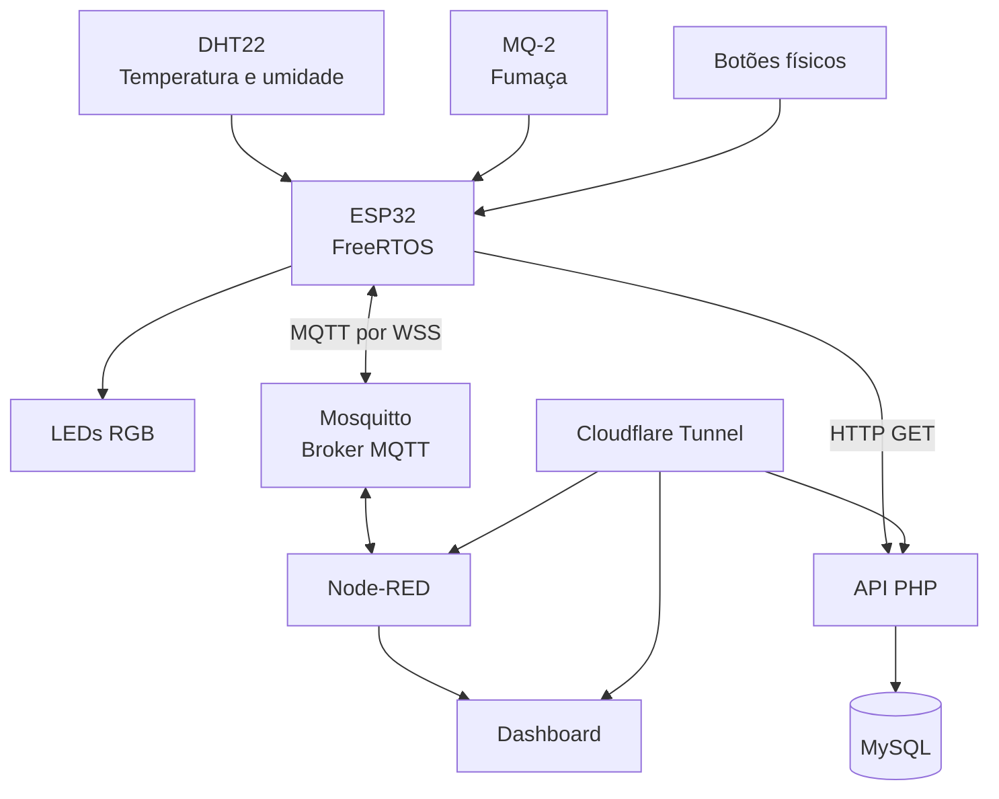

# Documentação do SmokeGuard

Esta pasta reúne a documentação técnica e operacional do **SmokeGuard**, sistema IoT desenvolvido para a disciplina de **Sistemas Embarcados** no **IFSP — Campus Catanduva**.

O projeto realiza o monitoramento de temperatura, umidade e presença de fumaça, permitindo supervisão remota, armazenamento das medições e controle dos indicadores luminosos.

## Sumário

1. [Acesso rápido](#acesso-rápido)
2. [Arquitetura do sistema](#arquitetura-do-sistema)
3. [Componentes utilizados](#componentes-utilizados)
4. [Tabela de pinagem do ESP32](#tabela-de-pinagem-do-esp32)
5. [Esquema de ligação](#esquema-de-ligação)
6. [Comunicação MQTT](#comunicação-mqtt)
7. [Comunicação HTTP e banco de dados](#comunicação-http-e-banco-de-dados)
8. [Instalação do servidor](#instalação-do-servidor)
9. [Configuração do Mosquitto](#configuração-do-mosquitto)
10. [Importação do Node-RED](#importação-do-node-red)
11. [Manual de operação](#manual-de-operação)
12. [Testes e validação](#testes-e-validação)
13. [Imagens do protótipo](#imagens-do-protótipo)
14. [Segurança](#segurança)

## Acesso rápido

- [README principal do projeto](../README.md)
- [Firmware do ESP32](../esp32/)
- [Código principal do ESP32](../esp32/smokeguard_freertos_tcp_direto/smokeguard_freertos_tcp_direto.ino)
- [Exemplo de credenciais](../esp32/smokeguard_freertos_tcp_direto/secrets.example.h)
- [Fluxo do Node-RED](../node-red/flows.json)
- [Aplicação web](../web/)
- [API PHP](../web/api.php)
- [Estrutura do banco de dados](../database/smokeguard_schema.sql)

## Arquitetura do sistema

O SmokeGuard é dividido em quatro camadas principais:

1. **Aquisição e controle:** ESP32, sensores, botões e LEDs;
2. **Comunicação:** MQTT e HTTP;
3. **Supervisão:** Node-RED e dashboard;
4. **Armazenamento:** API PHP e banco de dados MySQL.



### Fluxo dos dados

```text
Sensores
   │
   ▼
ESP32
   │
   ├── MQTT ──► Mosquitto ──► Node-RED ──► Dashboard
   │
   └── HTTP GET ──► API PHP ──► MySQL
```

## Componentes utilizados

| Componente | Função |
|---|---|
| ESP32 | Processamento, comunicação e controle |
| DHT22 | Medição de temperatura e umidade |
| MQ-2 | Detecção do nível de fumaça |
| LEDs RGB | Indicação visual dos estados |
| Botões físicos | Controle local do sistema |
| Mosquitto | Broker MQTT |
| Node-RED | Supervisão, controle e dashboard |
| Apache | Servidor da aplicação web |
| PHP | Processamento da API |
| MySQL | Armazenamento das medições |
| Cloudflare Tunnel | Acesso externo seguro aos serviços |

## Tabela de pinagem do ESP32

### Sensores

| Dispositivo | Sinal | GPIO do ESP32 |
|---|---|---:|
| DHT22 | Dados | GPIO 4 |
| MQ-2 | Saída analógica | GPIO 34 |

### LED RGB 1

| Cor | GPIO |
|---|---:|
| Vermelho | GPIO 25 |
| Verde | GPIO 26 |
| Azul | GPIO 27 |

### LED RGB 2

| Cor | GPIO |
|---|---:|
| Vermelho | GPIO 18 |
| Verde | GPIO 19 |
| Azul | GPIO 21 |

### Botões físicos

| Botão | Função | GPIO |
|---|---|---:|
| Botão 1 | Estado normal | GPIO 22 |
| Botão 2 | Estado de atenção | GPIO 23 |
| Botão 3 | Acionamento dos sprinklers | GPIO 32 |
| Botão 4 | Alerta com sprinklers | GPIO 33 |
| Botão 5 | Alteração do modo de operação | GPIO 13 |

## Esquema de ligação

### DHT22

| Pino do DHT22 | Ligação |
|---|---|
| VCC | 3,3 V |
| DATA | GPIO 4 |
| GND | GND |

Quando o sensor não possuir resistor integrado, deve ser utilizado um resistor de aproximadamente **10 kΩ** entre os pinos VCC e DATA.

### MQ-2

| Pino do módulo MQ-2 | Ligação |
|---|---|
| VCC | Alimentação indicada pelo módulo |
| GND | GND |
| AO | GPIO 34 |

> A entrada analógica do ESP32 não deve receber tensão superior a 3,3 V. Caso a saída analógica do módulo MQ-2 possa atingir 5 V, deve ser utilizado um divisor de tensão antes do GPIO 34.

### LEDs RGB

Os LEDs utilizados são do tipo **cátodo comum**.

- o terminal comum deve ser conectado ao GND;
- cada terminal de cor deve ser conectado ao respectivo GPIO;
- cada cor deve utilizar um resistor limitador de corrente;
- podem ser utilizados resistores entre **220 Ω e 330 Ω**.

Exemplo:

```text
GPIO do ESP32 ── Resistor ── Terminal da cor do LED
GND            ───────────── Cátodo comum
```

### Botões físicos

Os botões utilizam a configuração `INPUT_PULLUP`.

```text
GPIO do ESP32 ── Botão ── GND
```

Estados lógicos:

| Condição | Leitura |
|---|---|
| Botão solto | HIGH |
| Botão pressionado | LOW |

## Comunicação MQTT

O ESP32 se comunica com o broker Mosquitto por meio de MQTT utilizando WebSockets seguros.

### Tópicos utilizados

| Tópico | Direção | Função |
|---|---|---|
| `smokeguard/sensores` | ESP32 → Node-RED | Publicação das leituras |
| `smokeguard/comandos/leds` | Node-RED → ESP32 | Comandos dos LEDs |
| `smokeguard/status/leds` | ESP32 → Node-RED | Confirmação do estado dos LEDs |
| `smokeguard/comandos/modo` | Node-RED → ESP32 | Seleção do modo de operação |
| `smokeguard/status/modo` | ESP32 → Node-RED | Confirmação do modo atual |

### Fluxo MQTT

```text
ESP32 publica sensores
        │
        ▼
smokeguard/sensores
        │
        ▼
Node-RED atualiza o dashboard
```

```text
Node-RED envia comando
        │
        ▼
smokeguard/comandos/leds
        │
        ▼
ESP32 aplica o comando
        │
        ▼
smokeguard/status/leds
```

## Comunicação HTTP e banco de dados

Além da comunicação MQTT, o ESP32 envia as medições para uma API PHP por meio de requisições HTTP GET.

### Fluxo de armazenamento

```text
ESP32
  │
  ▼
API PHP
  │
  ▼
Validação dos dados
  │
  ▼
MySQL
```

### Banco de dados

Banco utilizado:

```text
sistema_iot
```

Tabela utilizada:

```text
leituras
```

Campos armazenados:

| Campo | Descrição |
|---|---|
| `id` | Identificador da leitura |
| `co2` | Valor associado ao nível de fumaça |
| `temperatura` | Temperatura medida |
| `umidade` | Umidade relativa medida |
| `data_hora` | Data e hora do registro |

O script da estrutura está disponível em:

```text
database/smokeguard_schema.sql
```

## Instalação do servidor

O servidor do SmokeGuard utiliza:

- Ubuntu Server;
- Apache;
- PHP;
- MySQL;
- Mosquitto;
- Node-RED;
- Cloudflare Tunnel.

### Atualização do sistema

```bash
sudo apt update
sudo apt upgrade -y
```

### Instalação do Apache e PHP

```bash
sudo apt install -y apache2 php php-mysql
```

Verifique o serviço:

```bash
sudo systemctl status apache2
```

### Instalação do MySQL

```bash
sudo apt install -y mysql-server
```

Verifique o serviço:

```bash
sudo systemctl status mysql
```

### Criação do banco de dados

Execute o script disponibilizado no repositório:

```bash
mysql -u root -p < database/smokeguard_schema.sql
```

### Arquivos da aplicação web

Os arquivos PHP devem ser copiados para o diretório utilizado pelo Apache:

```text
/var/www/html/
```

A configuração real do banco deve permanecer fora da pasta pública e fora do GitHub.

## Configuração do Mosquitto

### Instalação

```bash
sudo apt install -y mosquitto mosquitto-clients
```

### Habilitar o serviço

```bash
sudo systemctl enable mosquitto
sudo systemctl start mosquitto
```

### Usuários MQTT

O sistema utiliza contas separadas para:

- ESP32;
- Node-RED.

As senhas devem ser criadas diretamente no servidor e nunca adicionadas ao repositório.

Exemplo de criação de usuário:

```bash
sudo mosquitto_passwd -c /etc/mosquitto/passwd usuario_mqtt
```

Para adicionar outro usuário:

```bash
sudo mosquitto_passwd /etc/mosquitto/passwd outro_usuario
```

### Controle de acesso

As permissões devem limitar cada usuário aos tópicos necessários.

Exemplo conceitual:

```text
user usuario_esp32
topic read smokeguard/comandos/#
topic write smokeguard/sensores
topic write smokeguard/status/#

user usuario_nodered
topic read smokeguard/sensores
topic read smokeguard/status/#
topic write smokeguard/comandos/#
```

Após alterações:

```bash
sudo mosquitto -c /etc/mosquitto/mosquitto.conf -t
sudo systemctl restart mosquitto
```

## Importação do Node-RED

O fluxo utilizado está disponível em:

```text
node-red/flows.json
```

### Pacotes necessários

No diretório de instalação do Node-RED:

```bash
npm install node-red-dashboard
npm install node-red-node-mysql
```

### Importação do fluxo

1. abra o Node-RED;
2. clique no menu localizado no canto superior direito;
3. selecione **Import**;
4. escolha o arquivo `node-red/flows.json`;
5. confirme a importação;
6. configure o broker MQTT;
7. configure a conexão com o MySQL;
8. revise os endereços, portas e tópicos;
9. clique em **Deploy**.

### Funções do dashboard

O dashboard permite:

- visualizar temperatura;
- visualizar umidade;
- visualizar o nível de fumaça;
- acompanhar o modo atual;
- visualizar o estado dos LEDs;
- alternar entre modo manual e automático;
- comandar os estados dos LEDs;
- visualizar gráficos em tempo real;
- consultar registros históricos.

## Manual de operação

## Inicialização

1. energize o ESP32;
2. aguarde a conexão com a rede Wi-Fi;
3. aguarde a conexão com o broker MQTT;
4. verifique se as leituras aparecem no dashboard;
5. confirme se os dados estão sendo registrados no MySQL.

## Modos de operação

### Modo automático

No modo automático, o ESP32 analisa as leituras dos sensores e determina o estado de sinalização.

Condições monitoradas:

- temperatura acima do limite;
- umidade abaixo do limite;
- presença de fumaça;
- possível situação de incêndio.

### Modo manual

No modo manual, o operador pode escolher os estados por meio:

- dos botões físicos;
- do dashboard do Node-RED.

O ESP32 confirma o estado aplicado utilizando os tópicos de status.

## Estados de sinalização

| Sinalização | Estado |
|---|---|
| Verde contínuo | Operação normal |
| Verde e vermelho alternantes | Temperatura elevada ou umidade baixa |
| Vermelho e azul alternantes | Fumaça ou possível incêndio com sprinklers |
| Azul piscante | Sprinklers acionados |

## Procedimento em caso de alerta

1. identifique o estado indicado pelos LEDs;
2. consulte temperatura, umidade e fumaça no dashboard;
3. verifique se o sistema está em modo automático ou manual;
4. confirme se o alerta foi registrado;
5. verifique o ambiente físico;
6. acione os procedimentos de segurança aplicáveis ao local;
7. não utilize o protótipo como substituto de sistemas certificados de detecção de incêndio.

## Testes e validação

### Teste de temperatura e umidade

| Item | Resultado esperado |
|---|---|
| Leitura do DHT22 | Valores exibidos no monitor serial |
| Publicação MQTT | Dados recebidos no Node-RED |
| Dashboard | Valores atualizados |
| Banco de dados | Registro inserido no MySQL |

### Teste do sensor de fumaça

| Item | Resultado esperado |
|---|---|
| Alteração da concentração de fumaça | Mudança no valor analógico |
| Publicação MQTT | Valor recebido pelo Node-RED |
| Estado automático | Sinalização alterada conforme o limite |
| Histórico | Registro armazenado no MySQL |

### Teste dos comandos remotos

| Item | Resultado esperado |
|---|---|
| Comando enviado pelo dashboard | Mensagem publicada no tópico de comando |
| Recebimento pelo ESP32 | Estado aplicado |
| Confirmação | Status publicado pelo ESP32 |
| Dashboard | Estado físico e virtual sincronizados |

### Teste dos botões

| Botão | Resultado esperado |
|---|---|
| Normal | LEDs no estado normal |
| Atenção | Sinalização de atenção |
| Sprinklers | LED azul piscante |
| Alerta com sprinklers | Vermelho e azul alternantes |
| Modo | Alternância entre manual e automático |

### Registro de testes

Os testes podem ser documentados com a seguinte tabela:

| Data | Teste realizado | Resultado esperado | Resultado obtido | Responsável | Situação |
|---|---|---|---|---|---|
| DD/MM/AAAA | Descrição do teste | Resultado previsto | Resultado observado | Nome | Aprovado/Reprovado |

## Imagens do protótipo

### Protótipo completo

As imagens abaixo apresentam a montagem física do sistema SmokeGuard, incluindo o ESP32, os sensores, os botões e os indicadores luminosos.


- Botões da esquerda para a direita:
- Vermelho  = Botão de Estado de Alerta com Sprinklers Ativados;
- Pequeno 1 = Botão Ativar Sprinklers;
- Pequeno 2 = Botão Estado de Atenção;
- Pequeno 3 = Botão Estado Normal;
- Branco    = Botão de Troca de Modo (Manual ↔ Automático)


- Da esquerda para a direita,:
- Sensor Esquerda = MQ-2 (Fumaça);
- Sensor Branco = DHT-22 (Temperatura e Umidade);
- 2 LED's RGB Cátodo Comum
- 6 Resistores 1/4W de 330 Ω cada


### Dashboard

A imagem abaixo apresenta o Dashboard do projeto, contendo:
- Ponteiros para cada medição;
- Card indicativo com Status Real do Sistema definidos pelos parâmetros dos sensores
- Botão para assumir modo manual/automático
- Botões para alteração de status do sistema, quando em modo manual
- Card indicativo com Status do Sistema assumido por botão pressionado, quando em modo manual


## OBSERVAÇÕES IMPORTANTES

O SmokeGuard foi desenvolvido como protótipo acadêmico.

O sistema não substitui:

- detectores de fumaça certificados;
- alarmes de incêndio comerciais;
- sistemas profissionais de sprinklers;
- procedimentos legais e normativos de prevenção contra incêndios.

## Instituição

Projeto desenvolvido para a disciplina de **Sistemas Embarcados** no **Instituto Federal de Educação, Ciência e Tecnologia de São Paulo — IFSP, Campus Catanduva**.
